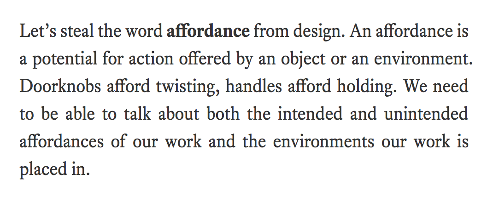

# Unjustifiable

Text justification on the web is really hideous. Browsers choose to naively cram
as much as they can on each line, but this greedy algorithm leaves "loose" lines
of text, with great gaping holes.

For hundreds of years, well-justified text was considered masterful and
beautiful; only in the era of the browser have designers turned their back on it
-- and with good reason. On a browser, justified text is ugly.

Was ugly.

With unjustifiable, text can look like this: 

Note the dangling punctuation, and that text can change styles inline -- bold
words are wider, but the text is still properly aligned.

See [my blog](http://diiq.org/#!/blog/interaction-words) for a full-length of
how unjustifiable makes justified text better.

Unjustifiable works best when paired with a hyphenating function; I recommend
[Hypher](https://github.com/bramstein/hypher) (that's what I use.)

Unjustifiable works beautifully on Chrome and safai, and well enough on Firefox,
and Edge. It **will leave a slightly ragged right on some mobile browsers**, and
it's up to you to decide what to do about that.

Unjustifiable will measure
the line-lengths all on its own; so floats, css indentations, and so on
all work correctly without additional information.

It is also aware of any style changes, and works around sub-elements
-- so inline tags like `<strong>`, `<em>`, and `<code>` are handled correctly.

## Installation 

```
yarn add unjustifiable
```

## Usage

```javascript
const justify = unjustifiable();
const elements = document.querySelectorAll(".content p");
elements.forEach(justify);
```

### Options

The `unjustifiable` function takes an optional options object. Defaults are shown below:

```javascript
options = {
  stretch: 15,
  shrink: -1,
  overhang: 20,
  hyphenPenalty: 1000,
  hyphenator: function(w) {
    // Returns an array of hyphenatable syllables
    return [w];
  },
};
const justify = unjustifiable(options);
```

#### Stretch

A measure of the default ability for a space to stretch wider, in px.

#### Shrink

A measure of the default ability for a space to shrink smaller, in px.

#### Overhang

The amount of space, in px, left for punctuation to dangle attractively over the right margin.

#### Hyphen penalty

The bigger this number is, the less likely Unjustifible is to break a line mid-word.

#### Hyphenator

To use Hypher for the hyphenator, install Hypher then:

```javascript
const hyph = new Hypher(en_us);
const options = unjustifiable({
  hyphenator: function(w) { return hyph.hyphenate(w); }
});
```

## Internally

It's a dynamic programming algorithm, like Knuth and Plass, but it's
faster than Knuth and Plass. The speed increase comes by accepting
suboptimal results for one part of its cost function: the difference
in compression between a line and the succeeding line.
